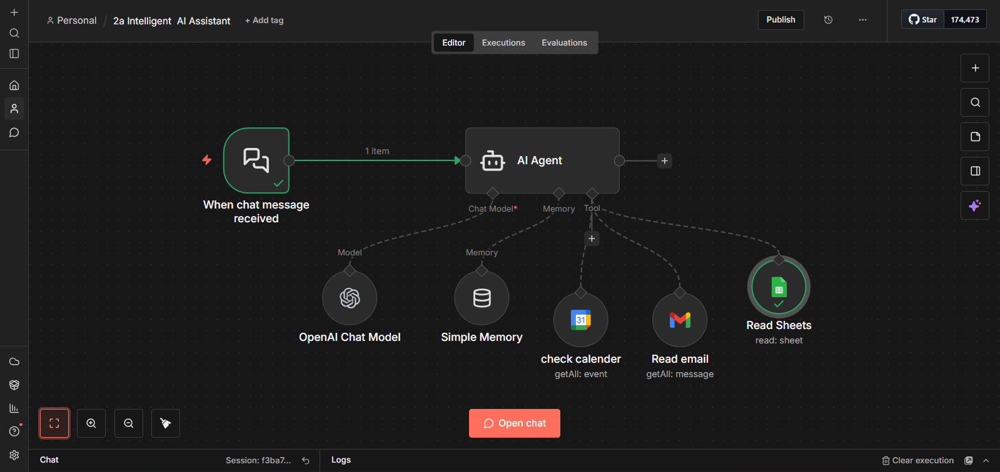
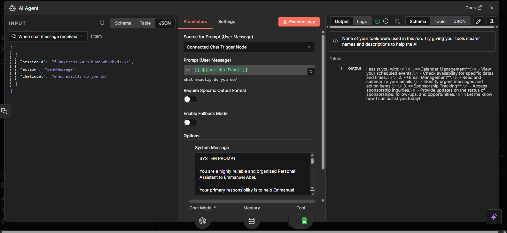
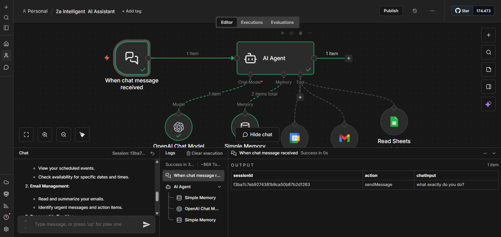

# Intelligent AI Assistant — n8n Workflow

> A conversational AI agent that connects to your Gmail, Google Calendar, and Google Sheets to give you real-time, context-aware assistance — built entirely without code in n8n.

---

## What It Does

Imagine starting your day by typing:

> *"Summarise my unread emails and tell me if I have any new sponsorship leads."*

Within seconds, you get a clean summary pulling live data from Gmail and Google Sheets. That's this system.

The **Intelligent Agent Integration System (IAIS)** combines an LLM (GPT-4o-mini) with real-world tool integrations and conversation memory. Unlike traditional automation that follows rigid rules, this agent:

- Understands natural language queries
- Decides which tools to use on its own
- Remembers previous messages within a session
- Surfaces actionable insights, not just raw data

---

## Architecture

```
Chat Message
     │
     ▼
 AI Agent  ──────────────────────────────────────────┐
     │                                                │
     ├── Chat Model (GPT-4o-mini via OpenAI API)      │
     ├── Simple Memory (last 10 messages)             │
     └── Tools ──────────────────────────────────────┘
           ├── Gmail          (getAll: message)
           ├── Google Calendar (getAll: event)
           └── Google Sheets   (read: sheet)
```

**Three core components:**

**Brain** — OpenAI GPT-4o-mini reasons over your queries, decides which tools to call, and synthesises the final response.

**Memory** — A Simple Memory node stores the last 10 conversation turns so the agent can handle follow-up questions naturally without you repeating context.

**Tools** — Three read-only integrations that fetch live data on demand:
- **Gmail** — reads and summarises emails, filters by sender, subject, or keyword
- **Google Calendar** — retrieves events, checks availability, identifies free slots
- **Google Sheets** — reads the Sponsorship Inquiry Tracker to surface leads, statuses, and follow-ups

---

## Screenshots

### Workflow Overview


### Agent Execution


### Testing the Agent


## Workflow File

The full n8n workflow is in [`Intelligent_AI_Assistant.json`](./workflow/Intelligent_AI_Assistant.json). Import it directly into your n8n instance.

---

## Setup

### Prerequisites

- [n8n](https://n8n.io) (self-hosted or cloud)
- OpenAI API key
- Google account with OAuth 2.0 credentials

### Steps

1. **Import the workflow**
   In n8n, go to **Workflows → Import** and upload `Intelligent_AI_Assistant.json`.

2. **Connect OpenAI**
   Add your OpenAI API credentials under the `OpenAI Chat Model` node.

3. **Connect Google services**
   Authenticate your Google account for each tool node via OAuth 2.0:
   - `Read email` — Gmail
   - `check calender` — Google Calendar (set your calendar email in the node)
   - `Read Sheets` — Google Sheets (set your spreadsheet URL in the node)

4. **Configure the Sheets URL**
   In the `Read Sheets` node, replace the `documentId` URL with your own Google Spreadsheet URL.

5. **Customise the system prompt** *(optional)*
   Open the `AI Agent` node and edit the system message to match your name, tools, and use case.

6. **Activate and chat**
   Click **Publish**, then open the chat interface via the `When chat message received` trigger.

---

## Example Queries

| Query | What the agent does |
|---|---|
| "Summarise my recent sent emails" | Reads Gmail, returns a structured summary with recipients and key topics |
| "Do I have any good sponsorship requests?" | Reads the Sheets tracker, highlights high-value opportunities |
| "What openings do I have tomorrow?" | Checks Calendar, lists busy periods and free slots |
| "Any overdue follow-ups?" | Reads Sheets, flags entries past their follow-up date |

---

## Use Cases

- Personal productivity assistant
- Sales lead and sponsorship management
- Client inquiry handling
- Schedule coordination
- Data analysis and daily briefings

---

## Limitations & Scope

All tool integrations are **read-only** by default. The agent can retrieve and summarise data but cannot send emails, create calendar events, or edit spreadsheets. Write access can be enabled per tool in n8n if needed.

Memory is session-scoped (in-memory buffer). Conversations are not persisted across sessions unless you swap the Simple Memory node for a database-backed memory type.

---

## Extending the System

The modular design makes it straightforward to add:

- **More tools** — Slack, Notion, Asana, a CRM, or any n8n-supported service
- **Write access** — enable create/update operations on existing tool nodes
- **Long-term memory** — replace Simple Memory with Postgres or Redis-backed memory
- **Different models** — swap GPT-4o-mini for any LangChain-compatible LLM

---

## Documentation

Full project documentation: [IAIS Project Docs](https://docs.google.com/document/d/1XgjQddgmescFOD8u7QU-31MSUnd3Vuok/edit)

---

## Tags

`n8n` `ai-agent` `automation` `langchain` `openai` `gmail` `google-calendar` `google-sheets` `no-code` `productivity`
